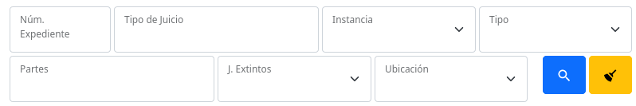
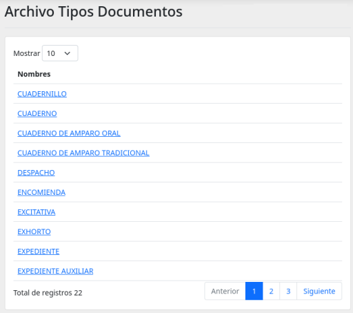
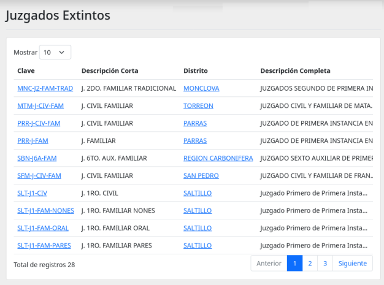
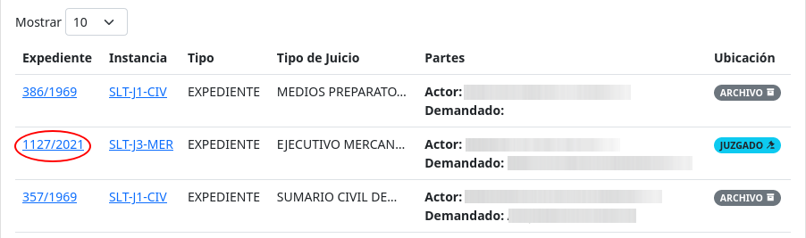
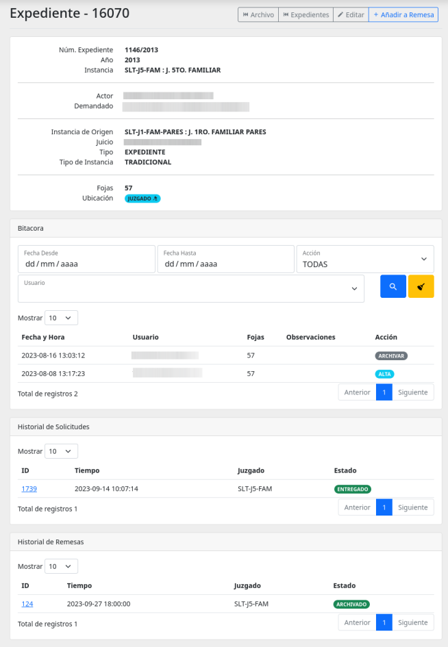
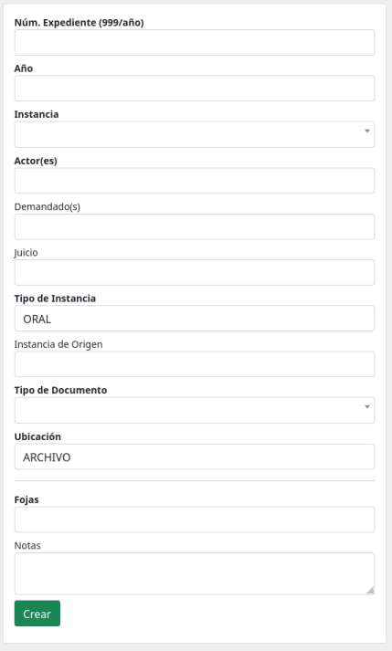

# Expedientes :material-file-document-multiple:

Este módulo lista, crea y edita Documentos utilizados por Archivo. Se complementa con el módulo de [Archivo](../arc_archivo).

También puede acceder a consultar los **Tipos de Documentos** y **Juzgados Extintos** para hacer la creación de documentos más fácil.

## Filtros de búsqueda

Uso de los filtros de búsqueda ubicados sobre el listado de documentos.

Utilice estos campos para ir reduciendo el listado de documentos. Puede utilizarlos en combinación, así si utiliza dos, los documentos listados deberán cumplir con ambas condiciones.

Puede presionar la tecla <kbd>Enter</kbd> o presionar el botón [:material-magnify:](#){ .md-button .md-button--primary } para iniciar la búsqueda.

Presione el botón [:material-broom:](#){ .md-button .md-button--warning } para limpiar todos los campo de filtros y mostrar todo el listado completo sin restricciones.

## Listado Menú Superior

En la pantalla del listado de documentos se presenta el siguiente menú superior

- **Juzgados Extintos**: Lista de todos los juzgados extintos registrador hasta el momento.
- **Tipos de Documentos**: En de todos los tipos de documentos que se pueden registrar en el módulo de Archivo.
- **Nuevo Documento**: Con este botón se dirigirá al pantalla con el formulario de captura para nuevos documentos.

## Listado - Tipos de Documentos

Se muestra el listado con todos los tipos de documentos aceptados por el módulo de Archivo.

??? Note "Como llegar a él"

    Acceda a él desde la pantalla principal del módulo **Expedientes** presionando el botón del [menú superior principal](#listado-menu-superior)[:material-file-code-outline: Tipos de Documentos](#){ .md-button .md-button--secondary }

## Listado - Juzgados Extintos

Se muestra el listado de todos los Juzgados Extintos registrados en el módulo de archivo.

??? Note "Como llegar a él"

    Acceda a él desde la pantalla principal del módulo **Expedientes** presionando el botón del [menú superior principal](#listado-menu-superior)[:material-map-marker-off: Juzgados Extintos](#){ .md-button .md-button--secondary }

## Detalle del Documento

Dentro de listado de documentos presione sobre el Número de Expediente indicado en rojo en la siguiente imagen:

Esto lo llevará al detalle del documento:

Dentro del detalle se muestran las diferentes secciones:

- **Detalle del documento**: Se en listan los detalles del documento.
- **Bitacora**: Se listan los motivos de los cambios que ha sufrido el documento.
- **Historial de Solicitudes**: Listado de solicitudes que ha tenido el documento.
- **Historial de Remesas**: Listado de las remesas en las que ha estado el documento.

## Nuevo Documento

En esta pantalla verá un formulario de captura para dar de alta un nuevo documento para su uso dentro del módulo Archivo.

### Búsqueda en Expediente Virtual

Si el documento es de años recientes o cree que ya fue capturado por algún sistema anterior, puede buscarlo mediante este formulario. Y si se encuentra los datos serán precargados para facilitar su captura.

Formulario para cargar nuevo documento

Campos a llenar. Los campos con títulos en negritas son obligatorios, no puede dejarlos vacíos.

- **Núm. Expediente (999/año)**: Es el número de expediente. Debe incluir el año como ejemplo: 123/2022.
- **Año**: Es obligatorio y debe estar en formato de cuatro dígitos. Se comprobara si coincide con el número de año del expediente.
- **Instancia**: El Juzgado al que pertenece. Si accesa desde una cuenta de juzgado este campo estará fijo con el juzgado al que está asignado.
- **Actor**: Nombre(s) del actor. Procure capturar el nombre lo más completo posible así hará más fácil la búsqueda en el futuro.
- **Demandado**: Nombre(s) de los demandados.
- **Jucio**: Nombre del Juicio.
- **Tipo de Instancia**: ORAL o TRADICCIONAL.
- **Instancia de Origen**: Es el juzgado donde se origino dicho documento, en caso se haber sido heredado de otro juzgado. [Véase juzgados extintos](#listado-juzgados-extintos). Debe dar al menos tres letras para comenzar a dar sugerencias.
- **Tipo de Documento**: Es el tipo de documento. [Véase tipos de documentos](#listado-tipos-de-documentos).
- **Ubicación**: Si pertenece a un juzgado no podrá modificar esta opción. Puede Eligir entre: ARCHIVO, JUZGADO, REMESA.
- **Fojas**: Número de hojas del documento.
- **Notas**: Notas que quiera hacer sobre el documento, estas se quedaran almacenadas dentro de la descripción del documento.

## Editar Documento

Edite información de un documento.

Dentro de listado de documentos presione sobre el Número de Expediente indicado en rojo en la siguiente imagen:

Esto lo llevará al detalle del documento, de ahí presione sobre el botón editar ubicado en el menú superior de botones.

Lo llevara a un [formulario de captura](#nuevo-documento), cambie los valores necesarios y guarde los cambios.

!!! Warning "Advertencia"

    Todo cambio realizado quedará registrado en la bitácora del documento. Coloque en el campo **Motivo** una descripción acorde al cambio o motivo del cambio realizado.
