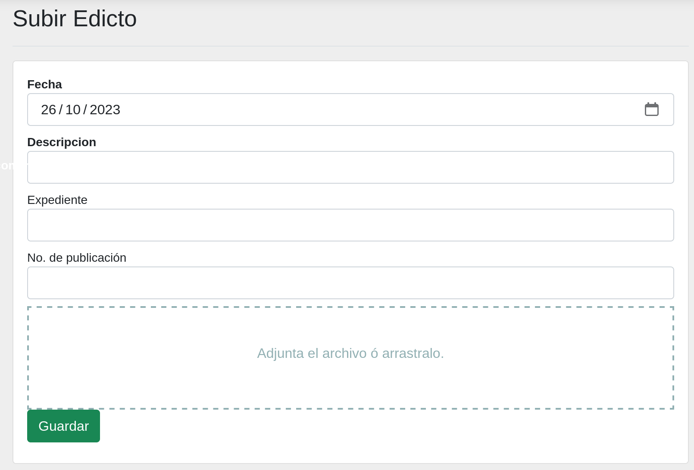

# Edictos :material-file-check:

## Objetivo

El objetivo de este módulo es el de publicar los edictos en el sitio web del Poder Judicial del Estado de Coahuila de Zaragoza. Por medio de esta herramienta digital se tienen muchos beneficios, como por ejemplo, toma poco tiempo y se tiene la seguridad de acceso para que los órganos jurisidiccionales y notarías registradas sean quienes los administren.

## Solicitud de registro para las notarías

Para solicitar el registro de una notaría o la actualización, se debe de enviar un correo electrónico a la dirección <informatica.notarias@pjecz.gob.mx> con la siguiente información y documentos en formato PDF:

- Nombre completo del notario
- Número de notaría
- Distrito Judicial del Estado de Coahuila de Zaragoza
- Correo electrónico de Google (Gmail) o Microsoft (Outlook, Hotmail, etc.)
- Teléfono
- Comprobante de domicilio
- Identificación oficial
- Acta de creación de la notaría

En un plazo de 20 días hábiles se le enviará un correo electrónico con la notificación de que puede accesar a [Plataforma Web](https://plataforma-web.justiciadigital.gob.mx/) o el motivo de rechazo.

Es responsabilidad de la notaría mantener actualizada la información proporcionada y la de cuidar el uso de la(s) cuenta(s) de correo que se usa(n) como autentificación para administrar los edictos publicados. Pueden solicitarse más de una cuenta de acceso por notaría.

En caso de detectar el uso inapropiado de este sistema se procederá con la suspensión de la cuenta.

## Pasos para publicar un edicto

Para publicar un edicto debe seguir los siguientes pasos:

1. Convertir el edicto a PDF
2. Ingresar a [Plataforma Web](https://plataforma-web.justiciadigital.gob.mx/)
3. En el menú lateral izquierdo, seleccionar la opción **Edictos**
4. Dar clic en el botón **Subir**
5. Llenar los campos correctamente del formulario
6. Dar clic en el botón **Guardar**

Después de haber guardado el edicto, podrá verlo en el sitio web.

## Para imprimir el acuse de recepción del edicto

Para imprimir el acuse de recepción del edicto debe seguir los siguientes pasos:

1. Ingresar a [Plataforma Web](https://plataforma-web.justiciadigital.gob.mx/)
2. En el menú lateral izquierdo, seleccionar la opción **Edictos**
3. Buscar el edicto que desea imprimir el acuse de recepción, el listado los muestra en orden cronológico, los más recientes primero. También puede utilizar el buscador para encontrarlo.
4. Dentro del detalle del edicto, dar clic en el enlace **Acuse: De click aquí**
5. Se abrirá una página que puede imprimir o guardar en formato PDF

## Formulario para subir un Edicto

En esta pantalla, encontrará un formulario de captura diseñado para cargar edictos destinados a su publicación en el sitio web. Llene los campos y adjunte el edicto en formato _(.pdf)_ para completar el proceso.

## Listado de un edicto

En esta pantalla, podrá visualizar todos los edictos que han sido cargados.

## Detalle de un edicto

En esta seección, se presenta un desglose detallado de la información asociada a un edicto. Al hacer clic en el link del la descripción que se muestra en el listado, se desplegará una vista detallada que incluirá aspectos como la fecha de publicación, la descripción completa y cualquier otro dato relevante.

Para realizar acciones adicionales, como la edición o eliminación del edicto, consulte las secciones correspondientes en este manual.

## Cambiar la información de un edicto

Si es necesario editar la información cargada en el formulario, simplemente haga clic en el botón [:material-pencil: Editar](#){ .md-button .md-button--primary }. Esto abrirá el siguiente formulario, donde podrá realizar los cambios necesarios en la información.

## Buscar un edicto

Para buscar edictos pasados, presione el botón de [:material-magnify: Buscar](#){ .md-button .md-button--secondary }. A continuación, se abrirá un formulario que le permitirá realizar búsquedas utilizando cualquiera de las opciones disponibles.

## Eliminar un edicto

En la barra de menú superior, encontrará el botón [:material-delete: Eliminar](#){ .md-button .md-button--danger }. Puede utilizar este botón para seleccionar y eliminar el edicto que se necesita quitar, en caso de que el documento adjunto no sea correcto.

## Recuperar un edicto que se eliminó

Si ha eliminado un edicto por error, tiene la opción de recuperarlo.

