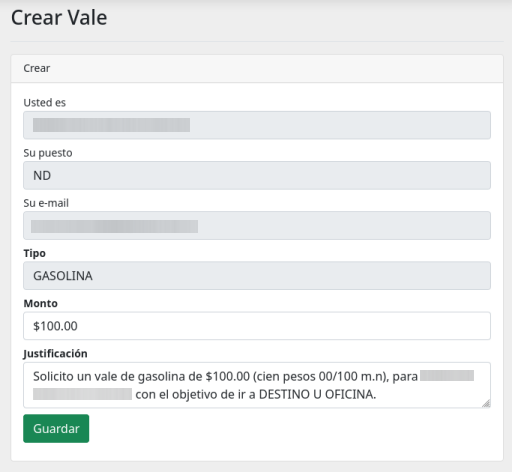
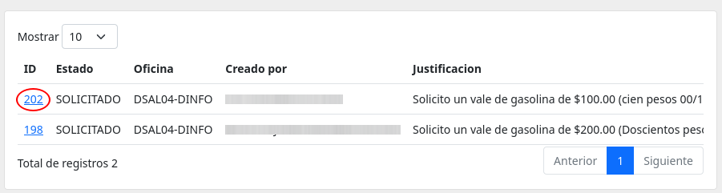
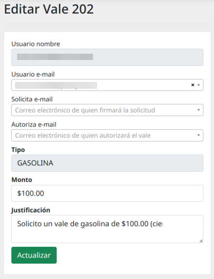
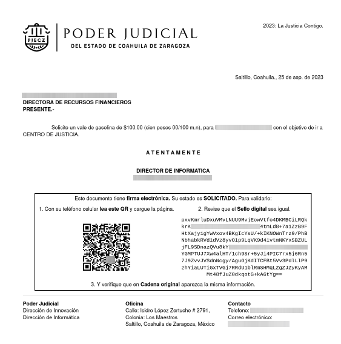

# Vales de Gasolina :material-gas-station:

Módulo para solicitar vales de gasolina 

## Solicitar un nuevo vale de gasolina

**Paso 1.-** Presionar sobre el botón [:material-plus: Crear](#){ .md-button .md-button--primary } ubicado en la barra de botones superior.

Te llevará a un formulario donde debes especificar el **Monto** y la **Justificación**.

Presiona el botón de botón de **Guardar** para continuar.

!!! Warning

    Especifica bien la **justificación**, porque por defecto coloca un ejemplo. Pero debes colocar a donde fuiste o adonde irás.

**Paso 2.-** Ubica el _vale_ dentro del listado. Presiona sobre su número de **ID** para editarlo.

Te llevará al **detalle del vale**.

**Paso 3.-** Ahora debes presionar sobre el botón de [:material-pencil: Editar](#){ .md-button .md-button--primary } de la barra de botones superior.

Te abrirá el formulario de **Edición de vale**.

Debes llenar el campo **Solicita e-mail** y **Autoriza e-mail**.

!!! Nota

    También puedes corregir el campo de **Monto** y **Justificación**.

Una vez terminado, presiona el botón de [Actualizar](#){ .md-button .md-button--success }. Te llevará al **detalle del vale**.

**Paso 4.-** Debes esperar a que el **Solicitante** continue y termine su proceso. Con esto aparecerá habilitado el botón de [:material-printer: Imprimir](#){ .md-button .md-button--primary .md-button--stretch }.

**Paso 5.-** Ya puedes mandar a imprimir el vale

