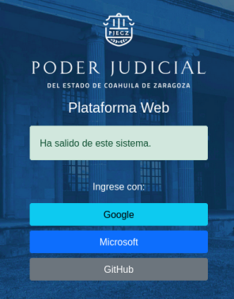
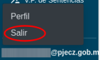
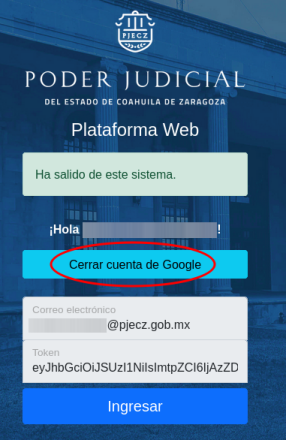
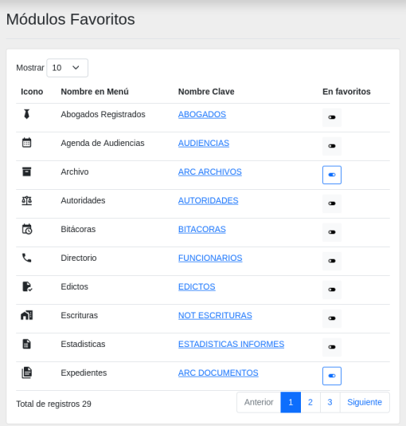

# Inicio

## Bienvenido a la documentación de Plataforma Web

Este es el manual y la referencia de uso de la [Plataforma Web](https://plataforma-web.justiciadigital.gob.mx/) que es el sistema web para la administración de la información interna y de los documentos que son publicados en el [sitio web](https://www.pjecz.gob.mx) del Poder Judicial del Estado de Coahuila de Zaragoza.

## Cómo solicitar acceso a Plataforma Web

Solicite a un compañero de su área que le levante un ticket de Soporte Técnico a la Dirección de Informática; donde debe de escribir la siguiente información:

- Nombre completo
- CURP
- Teléfono celular
- Correo electrónico en **@pjecz.gob.mx** o **coahuila.gob.mx**
- Área u oficina a la que pertenece
- Puesto
- Si los conoce, describa sus funciones o los roles que necesita usar en Plataforma Web

En un plazo de 5 días hábiles se le resolverá el ticket de soporte informándole si su acceso ha sido autorizado o no.

Una baja de Plataforma Web puede ocurrir cuando se da de baja del personal o cuando se suspende o se elimina la cuenta de correo electrónico.

## Cómo accesar a Plataforma Web

Su llave de entrada es su cuenta de _correo electrónico_ con la que está registrado.

Para entrar a Plataforma Web:

1. Abra su navegador de internet, de preferencia Google Chrome
2. Debe de tener iniciada su sesión de correo electrónico **@pjecz.gob.mx** o **coahuila.gob.mx**
3. Si su cuenta es **@pjecz.gob.mx** de clic en el botón **Google**
4. Si su cuenta es **@coahuila.gob.mx** de clic en el botón **Microsoft**
5. Se crea un _token temporal de acceso_. De clic en el botón **Ingresar**

## Usuarios personales y cuentas institucionales

Una cuenta personal es de uso personal para realizar actividades que competen al puesto o cargo que se ejerce.

En cambio, una cuenta institucional es de uso grupal, para un órgano jurisdiccional y utilizado por varias personas para efectuar acciones relacionadas con dicho órgano.

Plataforma Web lleva registro de todas las operaciones que se realizan dentro del sistema. Por lo que es importante que sepa que si alguien más utiliza su cuenta, se verá reflejado en el registro de operaciones.

## Menú de navegación

Para utilizar un módulo de click en su opción en el menú de navegación.

## Módulos habilitados y privilegios

Cada cuenta tiene un conjunto de permisos, es decir, con ellos podrá ver los módulos permitidos y realizar operaciones dentro de él.

## Solicitar cambios en sus privilegios

Para solicitar un cambio en sus privilegios, levante un ticket de Soporte Técnico a la Dirección de Informática; donde debe de escribir la siguiente información:

- Nombre completo
- Correo electrónico en **@pjecz.gob.mx** o **coahuila.gob.mx**
- Área u oficina a la que pertenece
- Puesto
- Si los conoce, describa sus funciones o los roles que necesita usar en Plataforma Web

## Si no recuerdo mi contraseña

Si su cuenta es **@coahuila.gob.mx** debe solicitar una nueva contraseña a la **Secretaría de Finanzas** en su **Dirección de Informática**.

Si su cuenta es **@pjecz.gob.mx** debe solicitar un cambio de contraseña a la **Dirección de Informática**. Levante un ticket de soporte técnico.

## Cerrar la sesión

1. Vaya al **final del menú principal** donde se encuentra la dirección de su _correo electrónico_, presione sobre él.
2. Un menú secundario se desplegará. Presione sobre la opción **Salir**. 
3. Presione sobre el botón **Cerrar cuenta de Google** o **Cerrar cuenta de Microsoft**. 
4. Cerrar el navegador.

## Favoritos :material-star:

Si tiene muchos módulos en su menú principal puede cambiar su configuración personal para que aparezcan al principio del menú principal.

1. De clic en **Favoritos**.
2. Aparece un listados con todos sus módulos. Presionando sobre el botón _switch_ puede activar que aparezca al principio.
3. Puede quitar módulos de sus favoritos apagando su _switch_ respectivo.

## Tickets de soporte técnico :material-tools:

Para solicitar ayuda sobre soporte técnico, use el módulo de [Tickets](https://plataforma-web.justiciadigital.gob.mx/soportes_tickets) para reportar problemas técnicos.
