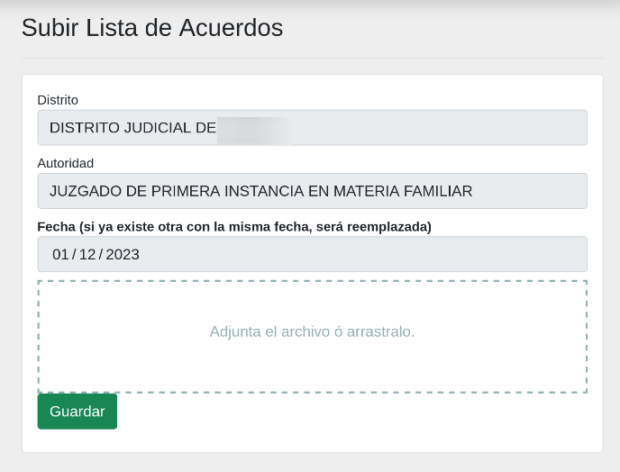
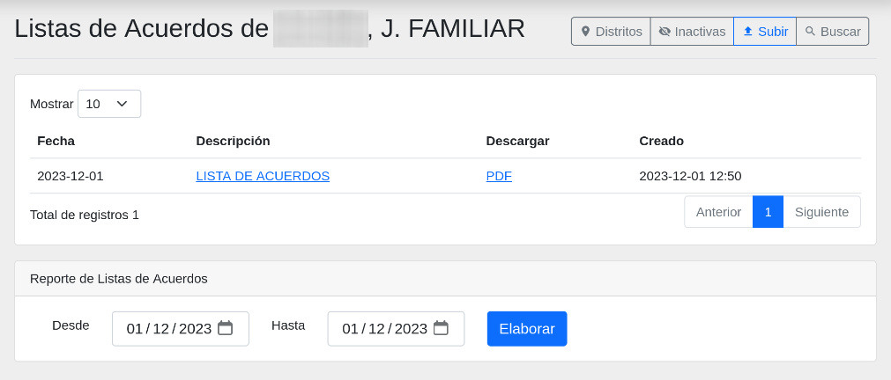
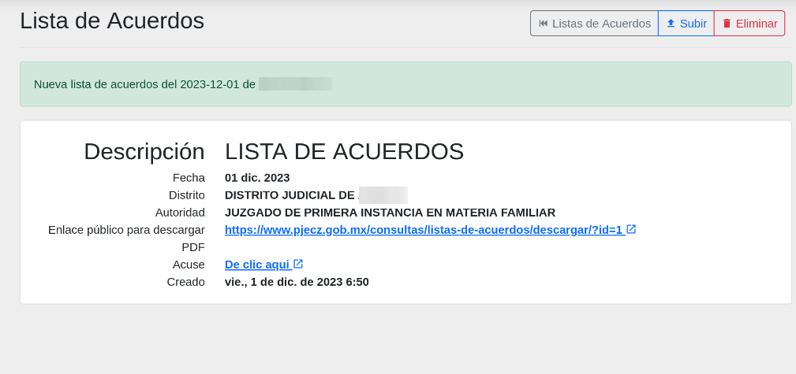
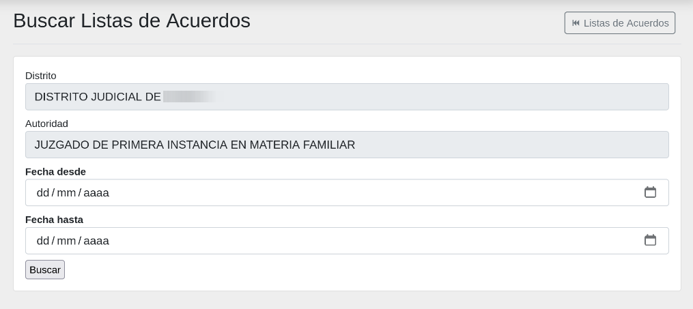
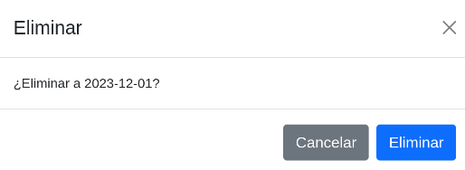
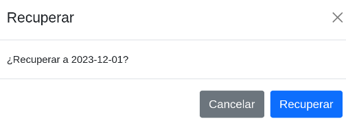

# Listas de acuerdos :material-file-document:

## Objetivo

El objetivo de este módulo es el de publicar las listas de acuerdos en el sitio web del Poder Judicial del Estado de Coahuila de Zaragoza. Por medio de esta herramienta digital se tienen muchos beneficios, como por ejemplo, toma poco tiempo y se tiene la seguridad de acceso para que los órganos jurisidiccionales sean quienes los administren.

## Pasos para públicar listas de acuerdos

Para publicar una lista de acuerdo debe seguir los siguientes pasos:

1. Convertir la lista de acuerdos a PDF
2. Ingresar a [Plataforma Web](https://plataforma-web.justiciadigital.gob.mx/)
3. En el menú lateral izquierdo, seleccionar la opción **Listas de acuerdos**
4. Dar clic en el botón **Subir**
5. Llenar los campos correctamente del formulario
6. Dar clic en el botón **Guardar**

Después de haber guardado la lista de acuerdos, podrá verlo en el sitio web.

## Formulario para subir una Lista de acuerdos

En esta pantalla, encontrará un formulario de captura diseñado para cargar listas de acuerdos destinados a su publicación en el sitio web. Llene los campos y adjunte la lista de acuerdos en formato _(.pdf)_ para completar el proceso.

## Listado de una lista de acuerdos

En esta pantalla, podrá visualizar todos las listas de acuerdos que han sido cargadas.

## Detalle de una lista de acuerdos

En esta seección, se presenta un desglose detallado de la información asociada a una lista de acuedos. Al hacer clic en el link del la descripción que se muestra en el listado, se desplegará una vista detallada que incluirá aspectos como la fecha, la descripción, la autoridad y cualquier otro dato relevante.

Para realizar acciones adicionales, como la eliminación de la lista de acuerdos, consulte las secciones correspondientes en este manual.

## Buscar una lista de acuerdos

Para buscar listas de acuerdos pasadas, presione el botón de [:material-magnify: Buscar](#){ .md-button .md-button--secondary }. A continuación, se abrirá un formulario que le permitirá realizar búsquedas utilizando los campos disponibles por fecha desde a fecha hasta, es necesario colocar las dos fechas.

## Eliminar una lista de acuerdos

En la barra de menú superior, encontrará el botón [:material-delete: Eliminar](#){ .md-button .md-button--danger }. Puede utilizar este botón para seleccionar y eliminar la lista de acuerdos que se necesita quitar, en caso de que el documento adjunto no sea correcto.

## Recuperar una lista de acuerdos que se eliminó

Si ha eliminado una lista de acuerdos por error, tiene la opción de recuperarlo.

